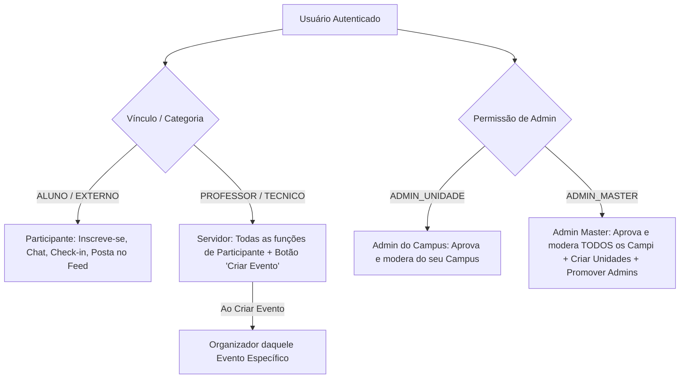

# GEMINI.md - Especificação Definitiva e Arquitetura do IFAM Eventos

Este arquivo registra a **identidade oficial, infraestrutura, modelo de permissões e regras de negócio** do **IFAM Eventos**.

---

## 🏛️ 1. Identidade e Escopo do Sistema

O **IFAM Eventos** é um **ecossistema descentralizado de gestão de eventos e rede social** (disponível via Web e Aplicativo Mobile Nativo) exclusivo para o **Instituto Federal do Amazonas (IFAM)**.

### O que o sistema NÃO é:
* **NÃO** é um sistema para submissão de artigos científicos ou bancas de pós-graduação.
* **NÃO** possui perfis de login separados para organizadores.

### Estrutura do Monorepo:
* **`apps/web-admin`**: Portal Web e Painel Unificado de Gestão (Next.js 14 + React 18 + TailwindCSS).
* **`apps/mobile-app`**: Aplicativo Móvel Nativo em React Native / Expo.
* **`apps/backend`**: API REST + Socket.io + Prisma ORM (SQLite local / PostgreSQL produção).
* **`packages/types`**: Tipos e interfaces TypeScript compartilhados.

---

## 🔒 2. Regra Unificada de Perfis e Acessos (Usuário Único)

Todos os usuários acessam a mesma plataforma através do mesmo fluxo de autenticação. Os privilégios são concedidos dinamicamente com base no **vínculo (category)** e nas **permissões de administração (role)**:

### Detalhamento das Permissões:
1. **Alunos e Público Externo (`category: ALUNO | EXTERNO`)**:
   * Navegam no catálogo global, confirmam RSVP, fazem check-in por QR Code, conversam no chat e publicam no Feed do evento.
2. **Servidores (`category: PROFESSOR | TECNICO`)**:
   * Possuem todas as permissões acima + o botão **`+ Criar Evento`**.
   * Ao criar uma atividade, tornam-se organizadores **daquele evento específico**.
3. **Admin de Unidade (Comunicação do Campus) (`role: ADMIN_UNIDADE`)**:
   * Acessam o Painel de Administração com restrição ao seu **próprio Campus**. Aprova eventos e modera a rede social da unidade.
4. **Admin Master (`role: ADMIN_MASTER`)**:
   * Acessam o MESMO Painel de Administração com visão global de **TODOS os Campi**. Podem cadastrar novas unidades e promover servidores a Admin de Unidade.

---

## 📅 3. Estrutura dos Eventos, RSVP e Check-in Duplo

* **Hierarquia**: `Evento` > `Programações` (Palestras, Oficinas, Minicursos, Exposições).
* **Eventos Restritos e RSVP**: Servidores organizadores podem convidar usuários individualmente ou turmas/grupos. O convidado confirma presença com o botão "Vou comparecer" (RSVP).
* **Check-in Duplo por QR Code**: A presença real é validada via leitura do QR Code **no local e horário da programação específica**, liberando o certificado somente se o critério de presença for cumprido.

---

## 📱 4. Rede Social, Multimídia e Transmissões

* **Feed / Stories do Evento**: Participantes e organizadores publicam fotos e vídeos curtos no ambiente virtual do evento específico.
* **Transmissão e On-Demand**: Suporte a links de live (YouTube/WebRTC) e disponibilização automática do vídeo gravado pós-evento (*on-demand*).
* **Networking & Chat**: Chat nativo 1-para-1 ou em grupo com opção de ficar "Invisível" no networking e opção de bloqueio de usuários.

---

## 📜 5. Certificação Automatizada

* **Histórico Centralizado**: O usuário possui uma carteira no perfil com todos os seus certificados.
* **Papel Exato no Certificado**: Reflete a função exercida na programação (Ouvinte, Palestrante, Ministrante, Expositor, Autor ou Avaliador).
* **Liberação**: Automatizada via cruzamento de dados do Check-in por QR Code e liberação pelo organizador.

---

*Atualizado em 23 de Agosto de 2026.*
