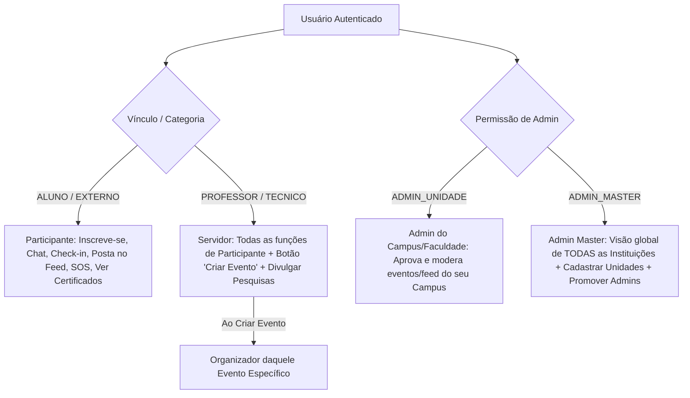

# GEMINI.md - Especificação Definitiva e Arquitetura do Unifik

Este arquivo registra a **identidade oficial, infraestrutura, modelo de permissões, pilares e regras de negócio** do **Unifik**.

---

## 🏛️ 1. Identidade e Escopo do Sistema

O **Unifik** é um **ecossistema acadêmico descentralizado, rede social ética e plataforma de gestão de eventos** (disponível via Web e Aplicativo Mobile Nativo) desenvolvido para **qualquer instituição de ensino** (Universidades Públicas e Privadas, Institutos Federais, Faculdades e Redes Escolares).

* **Marca Oficial**: **Unifik**
* **Slogan**: *"Unifik: Conectando a sua vida acadêmica."*
* **Símbolo Visual**: Escudo de Proteção + Livro Aberto / Asas de Decolagem + Foguete / Faísca de Inovação + Letra U.

### Estrutura dos 5 Pilares Centrais:
1. **Rede Social Ética & Segura**: Feed/Stories do campus, chat privado e comunidades protegidas com moderação anti-harassment.
2. **Suporte & Proteção a Riscos (SOS/Acolhimento)**: Central de ajuda rápida e acolhimento para situações de risco e emergências do aluno.
3. **Gestão de Eventos & RSVP**: Catalogo global de palestras, semanas acadêmicas, workshops e check-in duplo por QR Code.
4. **Vitrine de Produção Científica & Acadêmica**: Exposição de artigos, projetos de extensão, monitorias e portfólio estudantil.
5. **Carteira Digital de Certificados**: Emissão e armazenamento automatizado de certificados válidos e rastreáveis.

### Estrutura do Monorepo:
* **`apps/web-admin`**: Portal Web e Painel Unificado de Gestão (Next.js 14 + React 18 + TailwindCSS).
* **`apps/mobile-app`**: Aplicativo Móvel Nativo em React Native / Expo.
* **`apps/backend`**: API REST + Socket.io + Prisma ORM (SQLite local / PostgreSQL produção).
* **`packages/types`**: Tipos e interfaces TypeScript compartilhados.

---

## 💰 2. Modelo Comercial Híbrido (Monetização)

O **Unifik** mantém **todas as funcionalidades 100% liberadas** para alunos e professores em qualquer modalidade:

1. **Modalidade Gratuita (Ad-Supported)**:
   * Mantida por **Anúncios Éticos com Fit Acadêmico** (tecnologia, livros, cursos de idiomas, softwares de pesquisa, intercâmbios e oportunidades de estágio).
   * Proibição total de anúncios nocivos ou jogos de azar.
2. **Modalidade SaaS Institucional (Ad-Free)**:
   * Assinatura contratada por universidades, institutos ou escolas que desejam oferecer aos seus alunos um **ambiente 100% livre de anúncios**, com domínio próprio (`unifik.suafaculdade.edu.br`) e painel de analytics.
3. **Taxa de Conveniência em Eventos Pagos**:
   * Retenção de taxa percentual (5% a 8%) apenas sobre vendas de ingressos para congressos e simpósios pagos organizados na plataforma.

---

## 🔒 3. Regra Unificada de Perfis e Acessos (Usuário Único)

Todos os usuários acessam a mesma plataforma através do mesmo fluxo de autenticação. Os privilégios são concedidos dinamicamente com base no **vínculo (category)** e nas **permissões de administração (role)**:

### Detalhamento das Permissões:
1. **Alunos e Público Externo (`category: ALUNO | EXTERNO`)**:
   * Navegam no catálogo global, confirmam RSVP, fazem check-in por QR Code, conversam no chat, utilizam a central SOS, visualizam produções e publicam no Feed.
2. **Professores e Servidores (`category: PROFESSOR | TECNICO`)**:
   * Possuem todas as permissões acima + o botão **`+ Criar Evento`** e publicação de pesquisas/extensão.
   * Ao criar uma atividade, tornam-se organizadores **daquele evento específico**.
3. **Admin de Unidade / Campus (`role: ADMIN_UNIDADE`)**:
   * Acessam o Painel de Administração com restrição ao seu **próprio Campus/Faculdade**. Aprova eventos e modera a rede social da unidade.
4. **Admin Master (`role: ADMIN_MASTER`)**:
   * Acessam o MESMO Painel de Administração com visão global de **TODAS as Instituições**. Podem cadastrar novas unidades e promover administradores.

---

## 📅 4. Estrutura dos Eventos, RSVP e Check-in Duplo

* **Hierarquia**: `Evento` > `Programações` (Palestras, Oficinas, Minicursos, Exposições).
* **Eventos Restritos e RSVP**: Organizadores podem convidar usuários individualmente, turmas ou grupos. O convidado confirma presença com o botão "Vou comparecer" (RSVP).
* **Check-in Duplo por QR Code**: A presença real é validada via leitura do QR Code **no local e horário da programação específica**, liberando o certificado somente se o critério de presença for cumprido.

---

## 📱 5. Rede Social, Multimídia e Transmissões

* **Feed / Stories do Evento e Campus**: Participantes e organizadores publicam fotos, vídeos curtos e conquistas no ambiente virtual da instituição.
* **Transmissão e On-Demand**: Suporte a links de live (YouTube/WebRTC) e disponibilização automática do vídeo gravado pós-evento (*on-demand*).
* **Networking & Chat Seguro**: Chat nativo 1-para-1 ou em grupo com opção de ficar "Invisível" no networking, bloqueio de usuários e denúncias com inteligência anti-harassment.

---

## 📜 6. Certificação Automatizada & Produção Científica

* **Histórico Centralizado**: O usuário possui uma carteira no perfil com todos os seus certificados validados por QR Code e Hash.
* **Papel Exato no Certificado**: Reflete a função exercida na programação (Ouvinte, Palestrante, Ministrante, Expositor, Autor ou Avaliador).
* **Vitrine de Produção**: Espaço dedicado no perfil para exibição de resumos expandidos, artigos, projetos de extensão e monitorias.

---

*Atualizado em 3 de Setembro de 2026 com a consolidação oficial da marca Unifik.*

